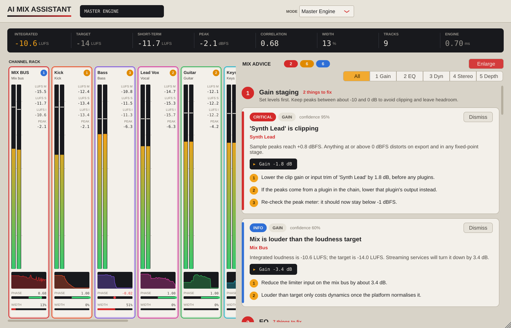

# AI Mix Assistant (JUCE · VST3 / AU / AAX)

One plugin binary, two modes:

* **Listener**: insert on every track. Measures the track (audio passes through bit-identical) and streams one analysis frame every 2048 samples to the Master Engine over a lock-free bus.
* **Master Engine**: insert on the mix bus. Collects every Listener, compares tracks against each other and the mix, and shows a channel rack plus diagnostic cards with step-by-step fixes.



## Layout

| Path | What |
|---|---|
| `core/` | JUCE-free C++17: bus, DSP, rule engine. Builds and tests with nothing but a compiler. |
| `core/include/aimix/AnalysisPayload.h` | The shared struct: track ID, RMS, peak, 512-bin FFT, phase correlation, M/S energy, LUFS, mono snapshot. |
| `core/include/aimix/SpscRingBuffer.h`, `SharedBus.h` | Phase 1: wait-free SPSC rings in a 64-slot shared-memory bus. |
| `core/src/Loudness.cpp`, `SpectralAnalysis.cpp`, `StereoAnalysis.cpp`, `DelayEstimator.cpp` | Phase 2: BS.1770 LUFS, Bark-band masking, Mid/Side, GCC-PHAT time offsets. |
| `core/src/TrackAnalyzer.cpp` | Listener audio-thread analyser (no allocation, const input). |
| `core/src/RoleClassifier.cpp` | "Auto" role: detects kick, snare, drums, bass, vocal or instrument from what a track sounds like. |
| `core/src/RuleEngine.cpp`, `MixEngine.cpp` | Phase 3: Master Engine thread and heuristic rules producing structured `Suggestion`s (JSON-serialisable). |
| `plugin/` | Phase 4: `AudioProcessor`, editor, `ui/ChannelRack`, `ui/DiagnosticCards`. |
| `tests/`, `bench/`, `tools/PluginChecks.cpp` | Phase 5: 48 unit tests, CPU benchmark, host-like checks + UI snapshots. |
| `docs/HOST_COMPATIBILITY.md` | What was validated, and the checklist for macOS/Windows/AAX hosts. |
| `docs/validation/` | Raw outputs of every check from the last run. |

## Build

```bash
# Core + tests + benchmark only (no JUCE needed)
cmake -S . -B build -DAIMIX_BUILD_PLUGIN=OFF
cmake --build build && ./build/aimix_tests && ./build/aimix_bench --quick

# Plugin (fetches JUCE 8.0.10). VST3 + Standalone everywhere, AU on macOS.
cmake -S . -B build -DCMAKE_BUILD_TYPE=Release
cmake --build build --target AIMixAssistant_All aimix_plugin_checks

# AAX: needs the Avid AAX SDK and PACE signing for Pro Tools release builds
cmake -S . -B build -DAIMIX_AAX_SDK_PATH=/path/to/aax-sdk
```

Use `-DAIMIX_JUCE_PATH=/path/to/JUCE` to build against a local JUCE checkout.

## Using it

1. Insert **AI Mix Assistant** on each track, ideally last in the chain. Leave **Role** on **Auto**: after a few seconds of playback the Master Engine works out whether the track is a kick, snare, drums, bass, vocal or another instrument, and the Listener shows what it detected. Pick a role yourself if the guess is wrong; roles decide which track yields when two of them clash.
2. Insert one more instance on the mix bus and set **Mode** to **Master Engine**.
3. Play the session. A card appears once a problem has been measured for about a quarter of a second, and stays until it is fixed: when the problem stops being measured the card turns green ("looks fixed") and disappears after about 3 seconds of playback without it. Stopping playback freezes the cards rather than clearing them. Click a strip to filter cards to that track; **Dismiss** hides a card for the session. **Enlarge** gives the advice the whole window (**Shrink** brings the channel rack back).

The advice is grouped into the order to mix in, so you can work top to bottom:

1. **Gain staging**: clipping, tracks recorded too hot or too low (peaks around -10 to 0 dB), mix headroom and loudness.
2. **EQ**: high-pass for non-bass tracks, mud at 250-500 Hz, harshness, tracks masking each other.
3. **Dynamics**: vocals and bass that need compression, squashed drums, drums that would gain weight from parallel compression, an over-compressed mix.
4. **Stereo placement**: bass, kick and vocal off centre, stereo low end, phase problems, mono compatibility, tracks to pan apart.
5. **Depth**: a vocal drowned in reverb on its insert, plus general reverb and delay tips (the plugin can't measure reverb itself).
6. **Final tip**: trust your ears.

Steps 3 and 4 need AI Mix Assistant on the individual tracks; the mix bus alone covers steps 1, 2 and mono/width.

**Only one instance, on the mix bus?** That works too and gives loudness, headroom, stereo/mono and overall tone (muddy, harsh) advice for the whole mix, with fixes on the mix bus. Advice about individual instruments, and which tracks clash, needs a Listener on those tracks.

Track names come from the host where it supports it (VST3, AU); the **Track** field overrides it.
